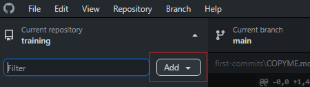
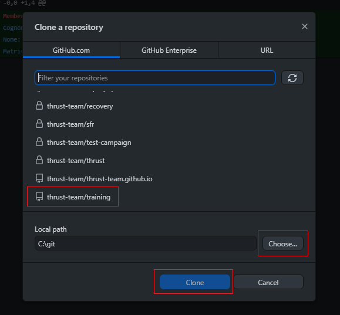

# Benvenuto nel team!
Adesso verrai inondato di informazioni per quel che riguarda come si fanno le cose qui.

## Telegram
Nel gruppo Telegram vengono inviati messaggi per l'organizzazione di riunioni e comunicazioni al volo. Se non sei dentro al gruppo entra nel [gruppo reclute](t.me/thrustrecruits) e uno degli admin ti sposterà nel gruppo principale.

## Discord
Nel [server discord](https://discord.gg/DjMsTrX) si trovano link utili allo sviluppo dei diversi settori, nonché il canale vocale per le riunioni e sezioni. Crea un account discord ed entra nel server così ti assegniamo il ruolo di membro del team per accedere ai canali.

## Github
### Iscrizione
GitHub è il sito che impieghiamo per salvare i repositori (le cartelle) su cui lavoriamo. Basato su `git`, è uno strumento che ci permette ti mantenere la storia delle modifiche e di vedere le differenze tra i file prima e dopo. Inoltre è un modo per tenere una cartella ufficiale e verificare chi fa quali modifiche (authoring).
Crea un account github e scrivi il tuo nick ad uno degli admin per farti aggiungere all'[organizzazione github del progetto thrust](https://github.com/thrust-team).

### Installa github desktop
- Scarica l'ultima versione di [Github Desktop](https://desktop.github.com/) e installalo.
- Accedi con l'account github con il quale ti sei registrato
- Aggiungi la repo `training` alle tue cartelle locali andando su `Add` in alto a sinistra
  
- poi `Clone repository`, dovresti trovare tutte le repo di `thrust-team`. Seleziona `thrust-team/training`, scegli la cartella locale dove salvare la cartella e premi `Clone`.
- Ora hai la tua copia locale della cartella sincronizzata con quella condivisa.
- Copia il file `COPYME.md` e rinominalo con  il tuo cognome e nome nel formato`cognome-nome.md`. Aprilo (con blocco note) e inserisci i dati richiesti.
- 
### Il tuo primo commit
_da inserire_

## Markdown
Addio Word crudele! A parte gli scherzi, gran parte dei documenti su github sono scritti in un formato cosiddetto MarkDown. Questo è un formato di testo che permette di formattare il documento in modo semplice e con file di solo testo. L'utilità è che file di questo tipo possono essere convertiti in ogni formato (word, pdf, latex, html) con estrema semplicità. Con questo formato puoi anche formattare i messaggi su Telegram e Discord.

## Overleaf
I documenti del progetto vengono pubblicati compilandoli con LaTex. Lo strumento più comodo per fare questo è un sito chiamato OverLeaf che permette di modificare in simultanea con altri utenti i file sorgenti dei documenti. Non solo, permette anche di compilare un'anteprima, tutto all'interno del browser. La grafica di un documento LaTeX è ormai nota e simbolo di "serietà accademica". L'intera repo thrust-team/latex è collegata ad un progetto overleaf, in modo da avere tutti i documenti ufficiali e i sorgenti a portata di mano nello stesso progetto.

## Drive
Per tutto il resto c'è una [cartella drive](https://drive.google.com/drive/folders/1e2mxLXh0za5J9UVuKT-l3MwX0Z3ZBW0D) con file sparsi che non dovrebbe essere usata per un lungo tempo. Può andare bene per compilare tabelle in collaborazione online (google fogli) o per preparare presentazioni, o bozze di file di testo. Viene inoltre usata per condividere file di grosse dimensioni che è meglio non caricare su GitHub.

## Altro
### Il tuo primo issue
_da inserire_

### Il tuo primo documento
_da inserire_

### Pro mode
_da inserire_