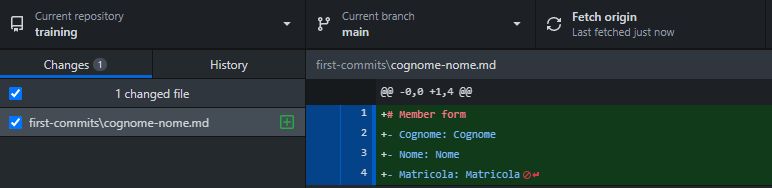

# Benvenuto nel team!
Adesso verrai inondato di informazioni per quel che riguarda come si fanno le cose qui.
Se incontri difficoltà in qualche passaggio non esitare a scrivermi e risolviamo il problema (è plausibile che le istruzioni non siano chiare).

## Hai Windows?

Ti consiglio di rendere visibili le estensioni dei file noti. Per farlo:

- Apri una cartella qualsiasi del tuo computer
- Seleziona la scheda `Visualizza` in alto
- Premi l'icona con le spunte `Opzioni cartella`
- Seleziona la scheda `Visualizza` del popup che si apre
- Togli la spunta alla voce `Nascondi estensioni per i tipi di file noti`

## Telegram
Nel gruppo Telegram vengono inviati messaggi per l'organizzazione di riunioni e comunicazioni al volo. Se non sei dentro al gruppo entra nel [gruppo reclute](t.me/thrustrecruits) e uno degli admin ti sposterà nel gruppo principale.

## Discord
Nel [server discord](https://discord.gg/DjMsTrX) si trovano link utili allo sviluppo dei diversi settori, nonché il canale vocale per le riunioni e sezioni. Crea un account discord ed entra nel server così ti assegniamo il ruolo di membro del team per accedere ai canali.

## Github
### Iscrizione
GitHub è il sito che impieghiamo per salvare i repositori (le cartelle) su cui lavoriamo. Basato su `git`, è uno strumento che ci permette ti mantenere la storia delle modifiche e di vedere le differenze tra i file prima e dopo. Inoltre è un modo per tenere una cartella ufficiale e verificare chi fa quali modifiche (authoring).
Crea un account github e scrivi il tuo nick ad uno degli admin per farti aggiungere all'[organizzazione github del progetto thrust](https://github.com/thrust-team).

### Github Desktop e primo commit
- Scarica l'ultima versione di [Github Desktop](https://desktop.github.com/) e installalo.
- Accedi con l'account Github con il quale ti sei registrato
- Aggiungi la repo `training` alle tue cartelle locali andando su `Add` in alto a sinistra
  
- Cliccando  `Clone repository`, dovresti trovare tutte le repo di `thrust-team`. Seleziona `thrust-team/training`, scegli la cartella locale dove salvare la cartella e premi `Clone`. 
- Ora hai la tua copia locale della cartella sincronizzata con quella condivisa.
- Copia il file `COPYME.md` e rinominalo con  il tuo cognome e nome nel formato`cognome-nome.md`. Aprilo (con blocco note) e inserisci i dati richiesti.
- Se riapri Github Desktop troverai una vista simile a quella in figura .
- In alto a sinistra `Current repository` deve essere `training`. Il ramo `Current branch` deve essere quello principale `main`, e la cartella deve essere sincronizzata (`Fetch origin` non indica modifiche da dover scaricare). 
- A sinistra si trova la lista dei cambiamenti locali effettuati rispetto all'ultimo checkpoint della cartella. In questo caso dovresti trovare soltanto il file con il tuo cognome e nome. A destra un'anteprima del contenuto del file.
- Esegui il commit (sposta il checkpoint allo stato attuale della cartella) premendo `Commit to main` 
- Ora il tuo checkpoint locale è più "avanti" rispetto allo stato della cartella condiviso. Per portare la tua cartella locale allo stato condiviso devi eseguire il `push` della cartella locale alla cartella condivisa. 
- Congratulazioni! Hai eseguito il tuo primo commit e hai messo la tua prima "firma" a una modifica al progetto. Se visiti la [cartella dei primi commit](https://github.com/thrust-team/training/tree/main/first-commits) troverai quella con il tuo nome e nella [storia della cartella](https://github.com/thrust-team/training/commits/main/first-commits) vedrai il messaggio che ha archiviato la modifica e l'autore della stessa.

### Perché Github? O `git` in generale?

Lo strumento `git` è uno strumento estensivamente utilizzato per mantenere la storia delle modifiche a un progetto nel contesto di software design. Per un progetto studentesco bastato su simulazioni fisiche, stesura di documentazione tecnica si rivela di utilità fondamentale per garantire autenticità ad ogni modifica data dai membri, e per permettere di recuperare una versione precedente di qualsiasi cartella.

Github è la piattaforma più diffusa di progetti basati su `git`, e porta con sé strumenti di project management molto utili.

L'interfaccia grafica di Github Desktop permette anche ai non smanettoni di usare `git` senza dover impiegare linea di comando.

## Markdown
Addio Word crudele! Gran parte dei documenti su GitHub sono scritti in un formato chiamato MarkDown. Questo è un formato di testo che permette di formattare il documento in modo semplice e con file di solo testo. L'utilità è che file di questo tipo possono essere convertiti in ogni formato (word, pdf, latex, html) con estrema semplicità (con `pandoc` o altri). Con questo formato puoi anche formattare i messaggi su Telegram e Discord.

Per capire come si usa Markdown consiglio di seguire il tutorial di [Commonmark](https://commonmark.org/help/tutorial/), molto semplice e veloce. Tornerà utile più avanti.

## LaTeX
I documenti tecnici ufficiali del progetto vengono pubblicati compilandoli con LaTeX.

LaTeX è un linguaggio di programmazione tipografica, che permette la stesura di documenti tecnici separando la formattazione dal contenuto da scrivere (l'impostazione grafica è gestita dal compilatore, il contenuto è scritto in un file di testo con alcuni accorgimenti).

Purtroppo il Markdown di GitHub non supporta direttamente l'inserimento di formule matematiche scritte in LaTeX.

Per fare un corso accelerato posso consigliare il video di [Enkk](https://www.youtube.com/watch?v=e8vxRjpf95s).

### Overleaf
Lo strumento più comodo è un sito chiamato OverLeaf che permette di modificare in simultanea con altri utenti i file sorgenti dei documenti. Non solo, permette anche di compilare un'anteprima, tutto all'interno del browser. La grafica di un documento LaTeX è ormai nota e simbolo di "serietà accademica". L'intera repo `thrust-team/latex` è collegata ad un progetto overleaf, in modo da avere tutti i documenti ufficiali e i sorgenti a portata di mano nello stesso progetto.
- Registra un account su Overleaf e prova ad aprire il link che trovi sul `README.md`  di `thrust-team/latex`. Apri uno dei file `main.tex` nel navigatore di cartelle a sinistra e premi `Compila` in alto a destra. Scarica il pdf premendo l'apposito tasto e mandamelo in privato su Telegram.
- Esci dal progetto in corso e torna alla schermata principale di Overleaf. Crea un nuovo documento con il documento di esempio e modifica tutto ciò che vuoi. Mi è sufficiente che inserisci il tuo nome come autore, e che mi mandi, invece del pdf, il file `.tex` sorgente, questo nel gruppo Recruits di Telegram.

## Drive
Per tutto il resto c'è una [cartella drive](https://drive.google.com/drive/folders/1e2mxLXh0za5J9UVuKT-l3MwX0Z3ZBW0D) con file sparsi che non dovrebbe essere usata per un lungo tempo. Può andare bene per compilare tabelle in collaborazione online (google fogli) o per preparare presentazioni, o bozze di file di testo. Viene inoltre usata per condividere file di grosse dimensioni che è meglio non caricare su GitHub.
- Collegati al link sopra e richiedi accesso alla cartella, ti verrà conferito da uno degli admin.

## Altro
### Il tuo primo issue
_da inserire_

### Il tuo primo documento
_da inserire_

### Pro mode
_da inserire_